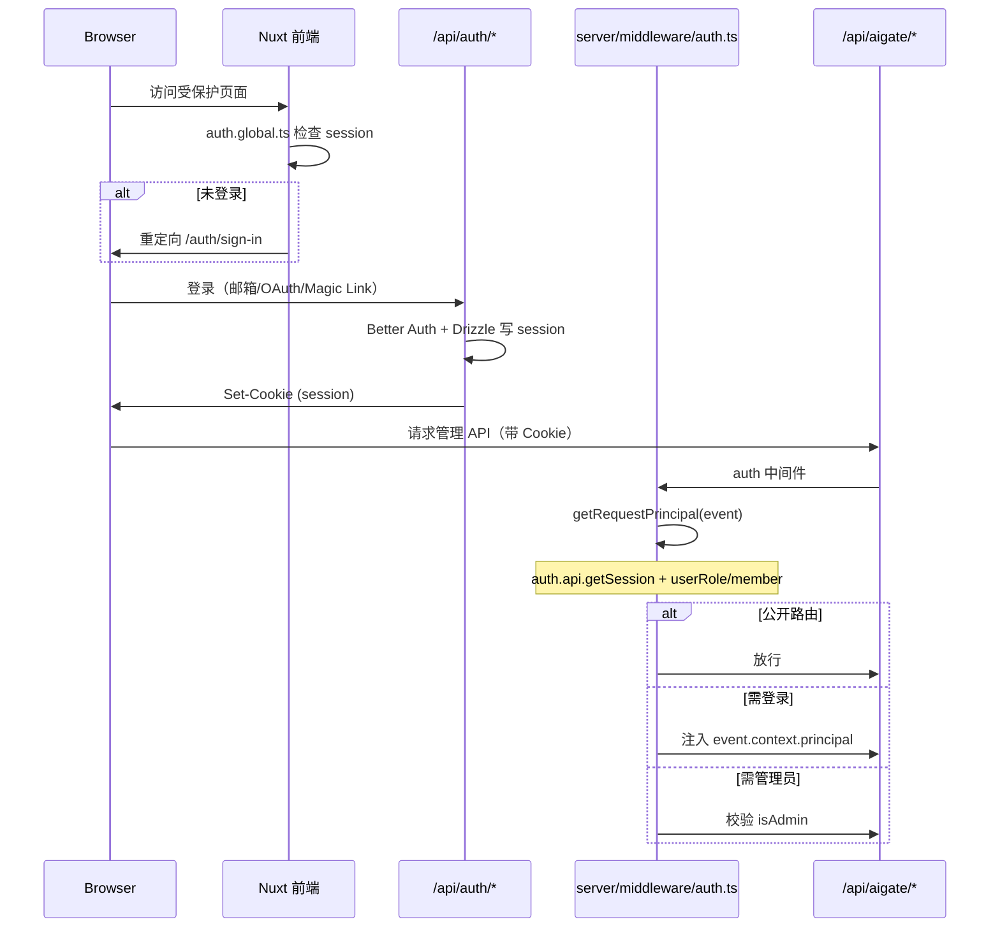
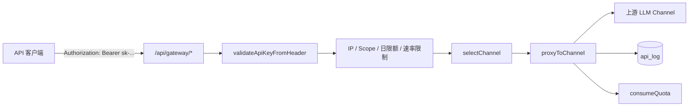

# AiGate 架构说明

本文档描述 AiGate 企业级 AI 管理平台的技术栈、目录结构、认证流程、Gateway 架构与数据库概览。

## 技术栈

| 层级     | 技术                      | 说明                                |
| -------- | ------------------------- | ----------------------------------- |
| 前端框架 | Nuxt 4、Vue 3、TypeScript | SSR/SPA 混合，Composition API       |
| UI       | Nuxt UI、Tailwind CSS 4   | 组件库与原子化样式                  |
| 状态管理 | Pinia + persistedstate    | 菜单、主题等客户端状态              |
| 国际化   | @nuxtjs/i18n              | 默认 `zh-CN`，支持 en               |
| 服务端   | Nitro（Nuxt Server）      | REST API、中间件、插件              |
| ORM      | Drizzle ORM + drizzle-zod | 类型安全的数据访问与校验            |
| 数据库   | PostgreSQL 15             | 主数据存储                          |
| 认证     | Better Auth               | 邮箱密码、Magic Link、OAuth、多会话 |
| 邮件     | Resend（nuxt-resend）     | 验证与通知邮件                      |
| 测试     | Vitest、Playwright        | 单元/集成与 E2E                     |
| 部署     | Docker、GitHub Actions    | 多阶段镜像与 CI/CD                  |

## 目录结构

```
AiGate/                      # 仓库根目录（Nuxt 应用）
├── app/                    # Nuxt 应用（前端 + 部分共享）
│   ├── assets/             # 全局 CSS、静态资源
│   ├── components/         # 可复用 Vue 组件
│   ├── composables/        # 组合式函数（API、分页、权限等）
│   ├── db/                 # Drizzle schema、migrations、drizzle.ts
│   ├── layouts/            # 页面布局
│   ├── middleware/         # 路由中间件（如 auth.global.ts）
│   ├── pages/              # 文件路由页面
│   │   ├── aigate/         # AI 网关、Agent、计费等业务页
│   │   ├── auth/           # 登录、注册、Magic Link
│   │   └── system-settings/ # 系统设置（用户、角色、菜单等）
│   ├── plugins/            # 客户端 Nuxt 插件
│   └── stores/             # Pinia stores
├── server/
│   ├── api/                # Nitro API 路由
│   │   ├── auth/           # Better Auth 处理器
│   │   ├── aigate/         # 管理端 REST API
│   │   ├── gateway/        # OpenAI 兼容网关代理
│   │   └── system-settings/
│   ├── middleware/         # 服务端中间件（auth、logs、error-handler）
│   ├── plugins/            # Nitro 启动插件（seed、Sentry 钩子等）
│   └── utils/              # 业务工具（gateway、auth、billing、quota 等）
├── shared/                 # 前后端共享类型与工具
├── docs/                   # 项目文档
├── scripts/                # 迁移、种子、运维脚本
├── e2e/                    # Playwright E2E
├── nuxt.config.ts
├── drizzle.config.ts
└── Dockerfile
```

## 认证流程

AiGate 使用 **Better Auth** 管理用户身份，前后端通过会话 Cookie 协作。



要点：

- **前端**：`app/middleware/auth.global.ts` 通过 `$authClient.useSession` 拦截未登录访问。
- **服务端**：`server/api/auth/[...all].ts` 将请求交给 `betterAuth` 处理器。
- **API 鉴权**：`server/middleware/auth.ts` 结合 `server/utils/routes.ts` 中的路由策略（公开 / 已登录 / 管理员）。
- **主体上下文**：`server/utils/context.ts` 的 `getRequestPrincipal` 聚合用户 ID、角色、组织 ID。

Gateway 路径（`/api/gateway/*`）使用 **API Key（Bearer）** 鉴权，不走会话 Cookie，见下文。

## Gateway 架构

Gateway 提供 OpenAI 兼容的代理入口，将客户端请求转发到已配置的上游 Channel。



核心模块：

| 文件                              | 职责                                            |
| --------------------------------- | ----------------------------------------------- |
| `server/api/gateway/[...path].ts` | 网关入口，编排校验、代理、日志                  |
| `server/utils/gateway.ts`         | API Key 校验、Channel 选择、上游代理、IP 白名单 |
| `server/utils/rate-limit.ts`      | 每分钟请求速率限制                              |
| `server/utils/quota.ts`           | 组织 Token 配额扣减                             |
| `server/utils/billing.ts`         | 计费记录（与 billing 模块联动）                 |

Channel 按 `priority` 与 `health` 选择可用上游；每次调用写入 `api_log`，并更新 API Key 的 `calls` / `cost` / `lastUsed`。

## 数据库概览

数据库为 **PostgreSQL**，Schema 定义于 `app/db/schema.ts` 与 `auth-schema.ts`，通过 Drizzle Kit 管理迁移（`app/db/migrations/`）。

### 认证与用户（Better Auth）

| 表             | 说明                                 |
| -------------- | ------------------------------------ |
| `user`         | 用户主表（邮箱、用户名、封禁状态等） |
| `session`      | 会话 Token                           |
| `account`      | OAuth / 凭证关联                     |
| `verification` | 邮箱验证、Magic Link 等              |

### 系统管理（RBAC）

| 表                                 | 说明         |
| ---------------------------------- | ------------ |
| `menu`                             | 菜单树       |
| `role` / `user_role` / `role_menu` | 角色与权限   |
| `internalization`                  | 国际化词条   |
| `logs`                             | 操作审计日志 |

### AI 与组织

| 表                                                | 说明                                       |
| ------------------------------------------------- | ------------------------------------------ |
| `organization` / `member`                         | 多租户组织与成员                           |
| `channel`                                         | 上游模型通道（endpoint、vendor、健康状态） |
| `ai_model`                                        | 模型元数据                                 |
| `api_key`                                         | 网关 API Key（scope、限额、IP 白名单）     |
| `api_log`                                         | 网关调用日志                               |
| `agent` / `conversation` / `conversation_message` | Agent 与对话                               |
| `knowledge_base` / `document`                     | 知识库与文档                               |
| `prompt` / `prompt_version`                       | 提示词版本管理                             |
| `mcp_tool` / `mcp_tool_version`                   | MCP 工具市场                               |
| `alert` / `alert_rule`                            | 告警与规则                                 |
| `billing_record`                                  | 计费流水                                   |

连接配置通过环境变量 `DATABASE_URL` 注入；本地开发可参考 `.env.example` 与 `docker-compose.yml` 中的 Postgres 服务。
